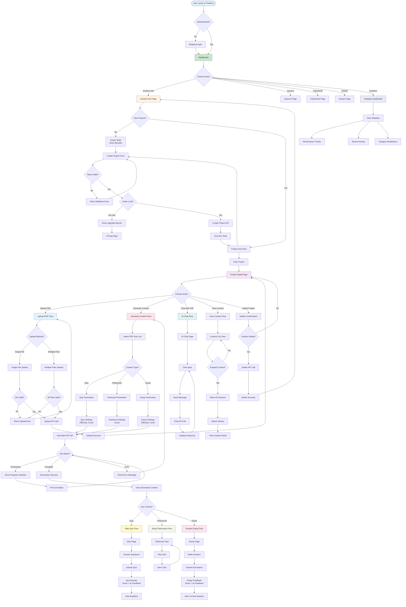
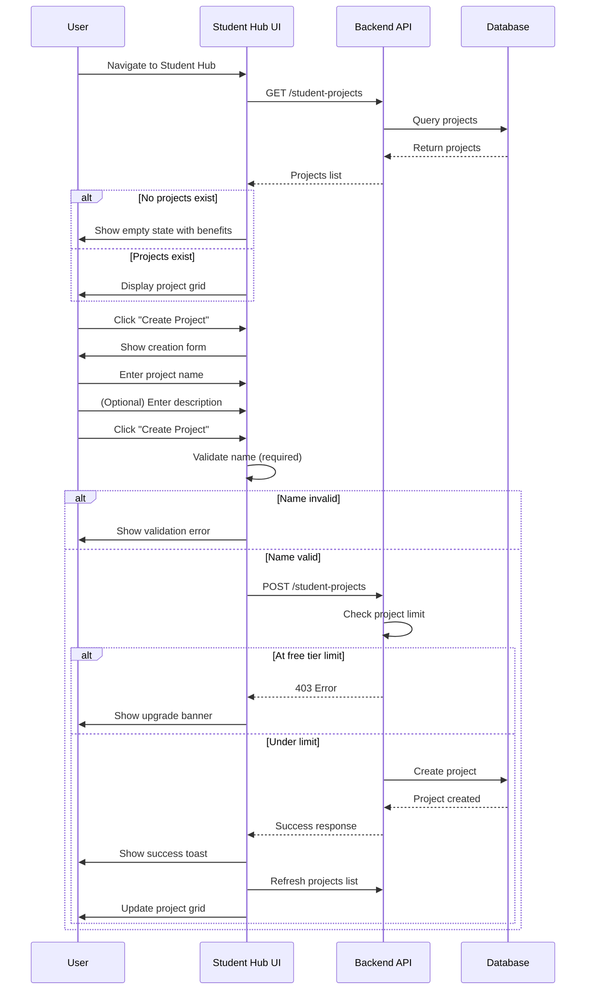
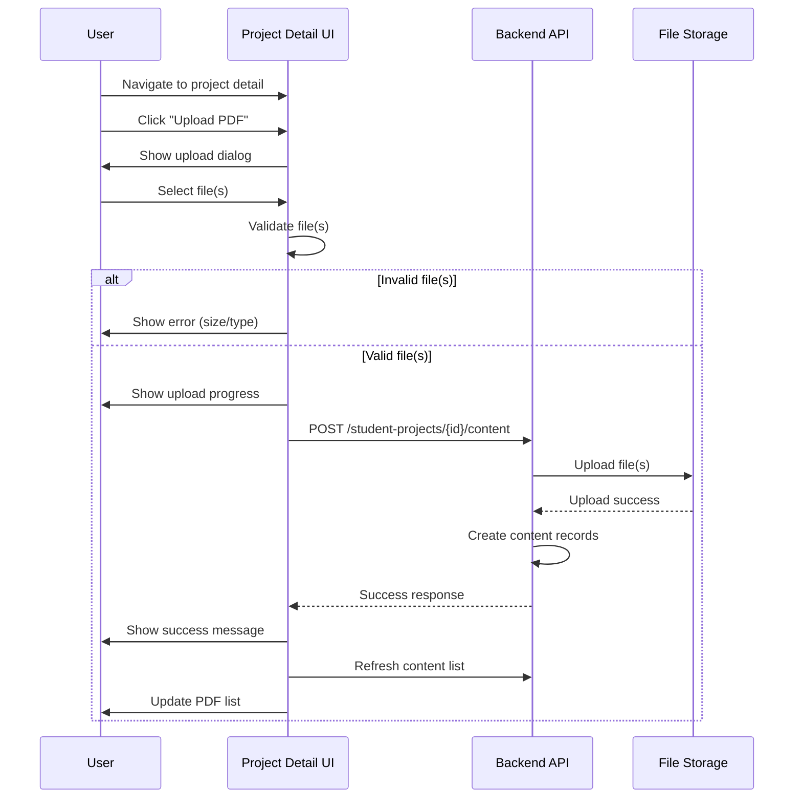
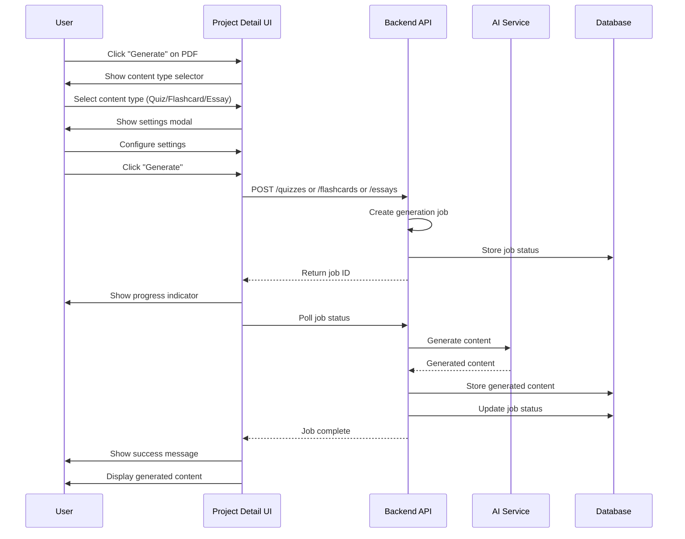
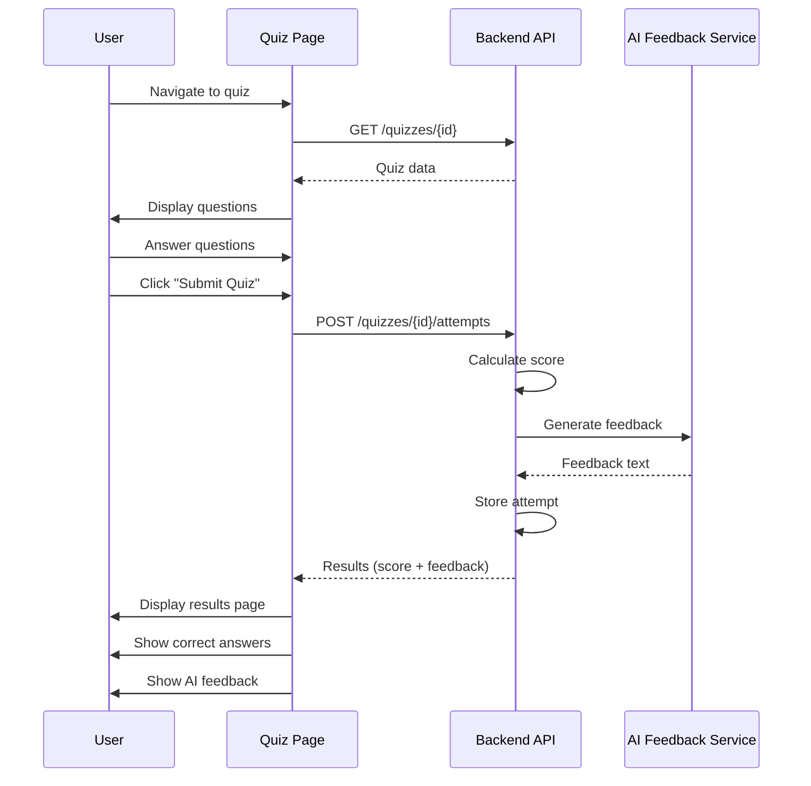

# Progrezz: Complete User Flow Diagram

## 🎯 Overview
This document outlines the complete user journey from project creation through all available features, designed with senior UX/UI best practices in mind.

---

## 📊 Main User Flow Diagram

---

## 🔄 Detailed Sub-Flows

### 1. Project Creation Flow (Detailed)

### 2. PDF Upload Flow (Detailed)

### 3. Content Generation Flow (Detailed)

### 4. Quiz Taking Flow (Detailed)

---

## 🎨 UX/UI Best Practices Applied

### 1. **Progressive Disclosure**
- ✅ Empty states guide users
- ✅ Settings hidden until needed
- ✅ Content versions collapsed by default

### 2. **Feedback & Status**
- ✅ Loading states for all async operations
- ✅ Success/error toasts
- ✅ Progress indicators for long operations
- ✅ Job status polling for generation

### 3. **Error Handling**
- ✅ Validation before submission
- ✅ Clear error messages
- ✅ Graceful degradation
- ✅ Retry mechanisms

### 4. **Accessibility**
- ✅ Keyboard navigation
- ✅ Screen reader support
- ✅ Focus management
- ✅ ARIA labels

### 5. **Performance**
- ✅ Lazy loading
- ✅ Optimistic updates
- ✅ Caching strategies
- ✅ Pagination for large lists

### 6. **User Guidance**
- ✅ Tooltips for complex features
- ✅ Help text in forms
- ✅ Onboarding for first-time users
- ✅ Contextual help

---

## 📱 Key User Journeys

### Journey 1: First-Time User Creates Project
1. User registers/logs in
2. Navigates to Student Hub
3. Sees empty state with benefits
4. Creates first project
5. Uploads PDF
6. Generates quiz
7. Takes quiz
8. Views feedback

### Journey 2: Returning User Adds Content
1. User logs in
2. Navigates to existing project
3. Uploads new PDF
4. Generates flashcards
5. Studies flashcards
6. Generates essay
7. Answers essay questions

### Journey 3: Power User Manages Multiple Projects
1. User navigates to Student Hub
2. Views all projects
3. Switches between projects
4. Manages content across projects
5. Views analytics dashboard
6. Tracks progress

---

## 🔍 Key Decision Points

### Project Creation
- **Limit Check**: Free tier (3 projects) vs Pro (unlimited)
- **Validation**: Name required, description optional
- **Success**: Immediate feedback + list update

### Content Generation
- **Job Status**: Async processing with polling
- **Error Handling**: Retry or show error
- **Success**: Display in content list

### Content Usage
- **Quiz**: Immediate results + AI feedback
- **Flashcards**: Interactive study mode
- **Essays**: Submit all → get feedback → view answers

---

## 🚀 Future Enhancements (UX Recommendations)

1. **Onboarding Tour**: Interactive guide for first-time users
2. **Templates**: Pre-configured project templates
3. **Bulk Operations**: Select multiple items for actions
4. **Search & Filter**: Find content quickly
5. **Keyboard Shortcuts**: Power user features
6. **Export Options**: Download content in various formats
7. **Collaboration**: Share projects with others
8. **Notifications**: Alerts for completed generations
9. **Dark Mode**: Theme preference
10. **Mobile Optimization**: Better mobile experience

---

## 📊 User Flow Metrics to Track

1. **Project Creation**: Time to create, success rate
2. **PDF Upload**: Upload success rate, average time
3. **Content Generation**: Generation time, success rate
4. **Content Usage**: Completion rates, engagement
5. **Error Rates**: Where users encounter issues
6. **Drop-off Points**: Where users abandon flows

---

*Last Updated: 2025-01-15*
*Version: 1.0*

